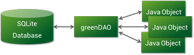

% MAD - Android 11: Android ORMs
% Patrick Sturm
% 05.04.2017

## Information

* Any issues with this presentation? Write a ticket or send me a pull request ;).
* Repo: [https://github.com/siyb/tw-mad-11-orm](https://github.com/siyb/tw-mad-11-orm)

# Agenda

## Agenda

* Introduction
* ORM / ORM Concepts
* greenDAO
* Outlook
    * alternatives (ORM / Databases)

# ORM / ORM Concepts

## ORM / ORM Concepts - 1 - General Information

* ORM stands for Object Relational Mapp(ing/er)
* AKA OR Mapper
* Using ORMs can reduce the amount of code we have to write
    * Reducing the amount of manually written code decreases the amount of bugs we produce
        * Maintenance is “easier” and takes less time
    * It _can_ be more time- and therefore cost effective
* By using an ORM, we have a more native feel when using relational databases
* Also offers: database abstraction!

## ORM / ORM Concepts - 2 - Mapping Data

* ORM provides mappings between Object Oriented programming languages and Relational Databases
    * One-to-One 1:1
    * One-to-Many 1:n
    * Many-to-Many n:m
    * Others (e.g. difference between hasOne - composition and belongsTo - aggregation)
* In order to establish the mapping, tables are “translated” to Objects
    * The mapping can be established automatically …
    * … or manually
* The use of DAOs (Data Access Objects) to abstract database access
* Some languages (like Java) feature APIs that can be used to implement ORMs (JPA – Java Persistence API)

## ORM / ORM Concepts - 3 - Pattern: ActiveRecord

* Database record is contained within an Object
* The Object also provides methods to save, update, delete itself
* The Class contains methods to find instances as well
* Adds other domain logic
* => SRP? Not so much, data and logic are mixed!
* Example: Sequlize, ActiveRecord (Rails), loopback ORM

## ORM / ORM Concepts - 4 - Pattern: Data Mapper

* Data Object and Database are separated
* Responsibilities are clearly defined
* Save / update / delete / find are not part of the entity
* Example: Hibernate / JPA - EntityManager, SQL Alchemy

## ORM / ORM Concepts - 5 - Lazy Loading

* Most ORMs support lazy loading for different data types, e.g.:
    * A LazyList<Car> will not contain all cars queried from the database, each individual Car’s data will be queried once it is accessed
    * Relations of the Car might also be loaded lazily, i.e. when the program tries to access it
* Lazy loading is very important on mobile devices, since memory is limited!

## ORM / ORM Concepts - 6 - Data Model Generation

* ORMs can be used on existing databases – more work
* The best idea is to let the ORM create and manage the database accordingly
    * Adds another layer of abstraction, you don’t have any direct control over what the database will look like …
    * … but you can make a good assumption about tables (e.g. join tables)
* As stated above, the ORM will take care of managing the database
    * New tables
    * Database updates if new data types are added
    * Etc.

## ORM / ORM Concepts - 7 - Queries

* Simple Queries are easily executed – in most cases, there is no need to write SQL queries by hand, but …
    * ORMs generally support writing of SQL statements
    * In addition to SQL, ORMs often support so called DSLs (Domain Specific Language) that allow more complex database operations
    * These DSLs may have a completely different syntax than the programming language / query language you are actually working with
        * e.g. JPA criteria queries
    * Alternatively (or in addition), ORMs might provide builders that can be used to create queries, either by using the DAO directly and/or by providing dedicated query builder classes

## ORM / ORM Concepts - 8 - Shortcomings / Criticism

* ORMs are a mere abstraction of the relational database
    * Object Orientation != Relational, mapping causes issues!
    * They introduce another layer of complexity
    * Even though this new layer of complexity is not a black box (in almost all cases), debugging can still be tedious, if the problem is situated within the guts of the ORM
* ORMs can be slow
    * Since data is automatically mapped, operations can be time consuming
* ORMs may hide functionality
    * -> Abstraction
    * Data types get abstracted, there is no way one can match all OOP data types to corresponding database types (especially with SQLite)
    * A list of additional reasons why mapping a relation database model to an OOP object model has some shortcomings (from a software engineering perspective) can be found [here](://en.wikipedia.org/wiki/Object-relational_impedance_mismatchhttp)

# greenDAO

## greenDAO - 1 - Introduction

* greenDAO – [http://greendao-orm.com](http://greendao-orm.com)
* greenDAO is an ORM which was written for Android
    * Therefore, it currently only supports SQLite (and I personally doubt that support for other databases will be added in the near future)
* As most Android related open source projects, greenDAO is licensed under the terms of the Apache License 2.0
* greenDAO uses the Data Mapper pattern and the active record pattern!

## greenDAO - 2 - Introduction cont.

* Design goals of greenDAO
    * Performance
    * Simple API
    * Optimized for Android
    * Small memory footprint
    * Small library size
    * OVERALL: designed for mobile use

## greenDAO - 3 - Introduction cont.



## greenDAO - 4 - Getting Started

* greenDAO consists of two components
    * the greenDAO gradle plugin, which generates code
    * the greenDAO library, which is used by your application

## greenDAO - 5 - Getting Started cont.

* Add the following dependency to your module:

    ```compile 'org.greenrobot:greendao:3.2.2'```

* Add the following apply directive to your module:

    ```apply plugin: 'org.greenrobot.greendao'```

* Add the following dependency to your project build file:

    ```classpath 'org.greenrobot:greendao-gradle-plugin:3.2.2'```

## greenDAO - 6 - Schema Metadata

* You can supply schema specific information using the module build file
    * schemaVersion - schema version, must be increased by 1 if schema changes, used by internal helper calls
    * daoPackage - optional: define an output package for the daos (defaults to source package)
    * targetGenDir - optional: define an output path for generated code (defaults to build/generated/source/greendao)
    * generateTests - optional: generate test cases, boolean (defaults to false)
    * targetGenDirTests - optional: generation path for test cases (defaults to src/androidTest/java)

## greenDAO - 7 - Schema Metadata cont.

```
greendao {
    schemaVersion 1
    daoPackage example.test.org
    targetGenDir /my/custom/dir/
    generateTests true
    targetGenDirTests /my/custom/test/dir
}
```
## greenDAO - 8 - Entity Modelling: Basics

* greenDAO uses annotations that are similar to what we know from JPA
* Make sure to use the correct annotations (IMPORTS!)
* @Entity - use this annotation on classes to mark them entities
    * Supports multiple options, remarkably, "active" can be used to add active record methods to the entity.
    * Can be used to add additional indecies
* @Id
    * Use this annotation to denote a PK field
    * Support autoincrement, no reuse of "old" IDs
* @NotNull
    * Use this annotation to add a NOT NULL constraint to a field
* @Property
    * May be used to define non default column names
* @Unique
    * UNIQUE constraint

## greenDAO - 9 - Example

```java
@Entity
public class Product {
  @Id
  private Long id;

  @NotNull
  @Unique
  private String name;
  
}
```

## greenDAO - 10 - Entity Modelling: Relations

* As with basic schema definition, greeDAO uses annotations to add relations to your model
* @ToOne - to one relationship, on an Object
* @ToMany - to many relationship, on a List
    * Multually exclusive ways to create the mapping:
    * referencedJoinProperty: defines the FK in the target entity
    * joinProperties: link via properties in models
    * @JoinEntity: creates a join table
        * entity: class reference to entity that is used for joining
        * sourceProperty / targetProperty: source / target FK properties

## greenDAO - 11 - Example

```java
@Entity public class Product {
  @Id
  private Long id;
}
@Entity public class Order {
  @Id
  private Long id;
  @ToMany
  @JoinEntity(entity = OrderProducts.class, 
    sourceProperty = "productId", targetProperty = "orderId")
  private List<Product> products;
}
@Entity public class OrderProduct {
  @Id
  private Long id;
  private Long productId;
  private Long orderId;
}
```

## greenDAO - 12 - Bidirectional Relationships

* You can model Bidirectional relationships using @ToOne / @ToMany
* Those relations are not linked with each other, you need to update them manually, even if an Order *has many* Products and a Product *has many* Orders, greenDAO does not understand the semantics of this relation and thus, you need to add the Order to the Product and the Product to the Order manually
* This is also true for other relational combinations

## greenDAO - 13 - Code Generation

* greenDAO will generate code in the specified directory:
    * DaoMaster
    * DaoSession
    * $(Entity)Dao
* The DaoSession can be used to work with all entities, the $(Entity)Daos are specialized on a per entity basis
* it will also generate code within your entity class
    * it will not delete your code in order to do that
    * it annotates generated code with the @Generated annotation ...
    * ... if you edit generated code, replace the @Generated annotation with the @Keep annotation to allow recompilation

## greenDAO - 14 - Initializing Database / DaoMaster / DaoSession

```java
private DaoMaster daoMaster; 
private DaoSession daoSession; 
private ProductDao productDao; 

private void initDatabaseAccess() { 
  SQLiteDatabase db = new DaoMaster
    .DevOpenHelper(this, "orders", null) 
    .getWritableDatabase(); 
  daoMaster = new DaoMaster(db); 
  daoSession = daoMaster.newSession(); 
  productDao = daoSession.getProductDao();
} 
```

## greenDAO - 15 - Inserting Data

```java
Product p = new Product();
p.setName("test");

Order o = new Order();
o.setName("Default Order");
daoSession.insert(o);

o.getProducts().add(p);

```

## greenDAO - 16 - More Write Operations

* The Entity DAOs feature multiple methods to interact with the Entity on the database level
    * insert(Entity)
    * update(Entity)
    * delete(Entity)
    * dropTable(…)
* Please note that entities themselves have access to active methods such as: refresh, update and delete (if @Entity(active = ...) is not false)
* In addition, they feature methods to execute CRUD operations within a transaction, e.g. deleteInTx(Entity)
* On top of all that, they facilitate query creation (both raw and ORM query) and they provide table and Entity meta data
* You can check all that stuff out yourself ;)

## greenDAO - 17 - Query Data

* The following example returns a list of Orders named "Default Order"

```java
private Order queryOrder() {
  List<Order> orders = orderDao
    .queryBuilder()
    .where(OrderDao.Properties.Name.eq("Default Order"))
    .and(OrderDao.Properties.OtherProperty.isNotNull())
    .build()
    .list();
}
```

## greenDAO - 18 - Query Data cont.

* This example returns a single order with the name "Default Order" via the daoSession and not the orderDao!

```java
Order order = daoSession
  .queryBuilder(Order.class)
  .where(OrderDao.Properties.Name.eq("Default Order"))
  .build()
  .unique();
```

## greenDAO - 19 - More On Querying

* Instead of using builder.list(), you may also use listLazy() which must be manually closed due to the nature of the implementation (use listLazy().close() when you are done)
* listLazy() is probably the best way to query data that needs to be displayed in an Android list
* joins are finally supported as well \o/
* http://greenrobot.org/greendao/documentation/queries/
* http://greenrobot.org/greendao/documentation/joins/

# [Example Code](https://github.com/SphericalElephant/android-example-greendao3)

## Outlook - 1 - More Android ORMs

* ActiveAndroid
    * Designed for Android
    * Similar to what sugarorm does
    * Very promising!
* ORMLight - http://ormlite.com/
    * Supports Android, is not made for Android
* androrm - http://androrm.com/
    * Designed for Android
    * Uses inheritance instead of generation
* Some more, use Google if you hadn’t enough ;)

# Any Questions?
